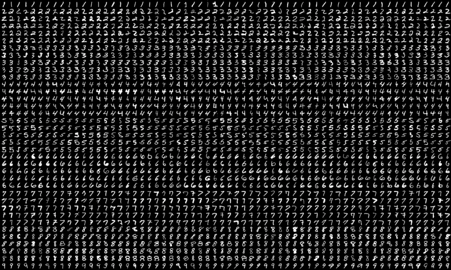

# Optical-Character-Recognition-MNIST-Fashion-MNIST-KNN-Python

<!-- [
[![Gitter] ()

[ -->

`MNIST` is a dataset of images—consisting of a training set of 60,000 examples and a test set of 10,000 examples. Each example is a 28x28 grayscale image, associated with a label from 10 classes. `Fashion-MNIST` is a dataset of [Zalando](https://jobs.zalando.com/tech/)'s article images—consisting of a training set of 60,000 examples and a test set of 10,000 examples. Also, to serve as a direct **drop-in replacement** for the original [MNIST dataset](http://yann.lecun.com/exdb/mnist/) for benchmarking machine learning algorithms. It shares the same image size and structure of training and testing splits.

Here's an example of how the data looks (*each class takes three-rows*):

## Technologies Used

<!--     

  -->

## Team
 |
-|
[Immanuvel Prathap's Website - Click Here!](https://immanuvelprathap.in/) |)

## License

## Credits

## References for researcher

Seriously, we are talking about replacing MNIST. Here are some good reasons:

- **MNIST is too easy.** Convolutional nets can achieve 99.7% on MNIST. Classic machine learning algorithms can also achieve 97% easily. Check out [our side-by-side benchmark for Fashion-MNIST vs. MNIST](http://fashion-mnist.s3-website.eu-central-1.amazonaws.com/), and read "[Most pairs of MNIST digits can be distinguished pretty well by just one pixel](https://gist.github.com/dgrtwo/aaef94ecc6a60cd50322c0054cc04478)."
- **MNIST is overused.** In [this April 2017 Twitter thread](https://twitter.com/goodfellow_ian/status/852591106655043584), Google Brain research scientist and deep learning expert Ian Goodfellow calls for people to move away from MNIST.
- **MNIST can not represent modern CV tasks**, as noted in [this April 2017 Twitter thread](https://twitter.com/fchollet/status/852594987527045120), deep learning expert/Keras author François Chollet.
- **OTHER LINKS.** [connectjaya](https://connectjaya.com/how-to-start-with-deep-learning-using-tensorflow/), [GoogleAI BLogs](https://ai.googleblog.com/2018/06/realtime-tsne-visualizations-with.html)

 
